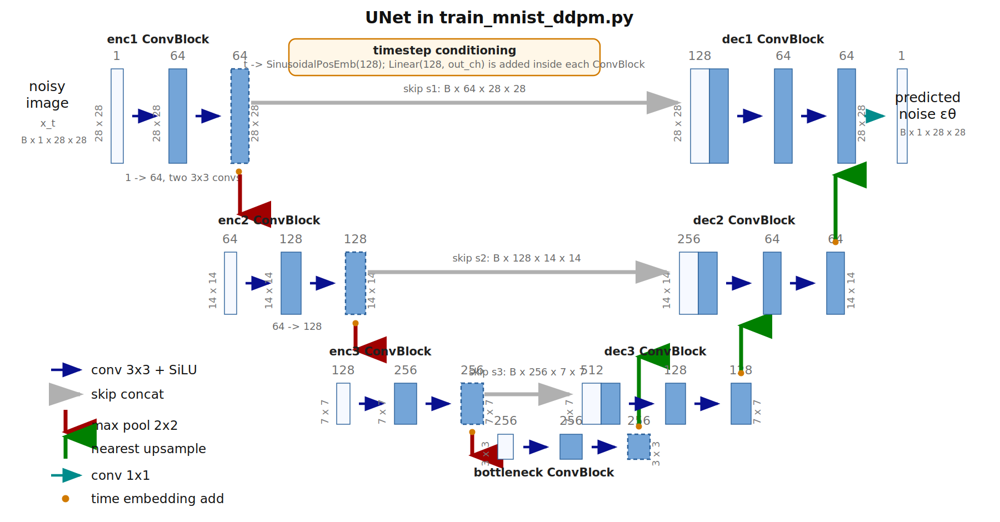

# MNIST DDPM UNet Architecture

This note visualizes the `UNet` used by [`train_mnist_ddpm.py`](./train_mnist_ddpm.py).

## Architecture Diagram



## ConvBlock Pattern

Every `ConvBlock(in_ch, out_ch, time_emb_dim=128)` has the same internal pattern:

```text
input x
  -> Conv2d(in_ch, out_ch, kernel=3, padding=1)
  -> SiLU
  -> Conv2d(out_ch, out_ch, kernel=3, padding=1)
  -> add Linear(128, out_ch)(SiLU(t_emb)) broadcast over H x W
  -> SiLU
```

So each block contains:

- 2 spatial convolutions.
- 1 timestep projection `Linear(128, out_ch)`.
- No normalization, residual connection, dropout, or attention.

## Layer-By-Layer Table

| Step | Code name | Operation | Input shape | Output shape | Learned layers |
|---:|---|---|---|---|---|
| 0 | `time_embedding` | sinusoidal embedding | `B` | `B x 128` | 0 |
| 1 | input | noisy image `x_t` | - | `B x 1 x 28 x 28` | 0 |
| 2 | `enc1` | `ConvBlock(1, 64)` | `B x 1 x 28 x 28` | `B x 64 x 28 x 28` | 2 conv + 1 linear |
| 3 | `pool(s1)` | `MaxPool2d(2)` | `B x 64 x 28 x 28` | `B x 64 x 14 x 14` | 0 |
| 4 | `enc2` | `ConvBlock(64, 128)` | `B x 64 x 14 x 14` | `B x 128 x 14 x 14` | 2 conv + 1 linear |
| 5 | `pool(s2)` | `MaxPool2d(2)` | `B x 128 x 14 x 14` | `B x 128 x 7 x 7` | 0 |
| 6 | `enc3` | `ConvBlock(128, 256)` | `B x 128 x 7 x 7` | `B x 256 x 7 x 7` | 2 conv + 1 linear |
| 7 | `pool(s3)` | `MaxPool2d(2)` | `B x 256 x 7 x 7` | `B x 256 x 3 x 3` | 0 |
| 8 | `bottleneck` | `ConvBlock(256, 256)` | `B x 256 x 3 x 3` | `B x 256 x 3 x 3` | 2 conv + 1 linear |
| 9 | `b_up` | nearest upsample | `B x 256 x 3 x 3` | `B x 256 x 7 x 7` | 0 |
| 10 | `cat([b_up, s3])` | skip concat | `256 + 256` channels | `B x 512 x 7 x 7` | 0 |
| 11 | `dec3` | `ConvBlock(512, 128)` | `B x 512 x 7 x 7` | `B x 128 x 7 x 7` | 2 conv + 1 linear |
| 12 | `d3_up` | nearest upsample | `B x 128 x 7 x 7` | `B x 128 x 14 x 14` | 0 |
| 13 | `cat([d3_up, s2])` | skip concat | `128 + 128` channels | `B x 256 x 14 x 14` | 0 |
| 14 | `dec2` | `ConvBlock(256, 64)` | `B x 256 x 14 x 14` | `B x 64 x 14 x 14` | 2 conv + 1 linear |
| 15 | `d2_up` | nearest upsample | `B x 64 x 14 x 14` | `B x 64 x 28 x 28` | 0 |
| 16 | `cat([d2_up, s1])` | skip concat | `64 + 64` channels | `B x 128 x 28 x 28` | 0 |
| 17 | `dec1` | `ConvBlock(128, 64)` | `B x 128 x 28 x 28` | `B x 64 x 28 x 28` | 2 conv + 1 linear |
| 18 | `out` | `Conv2d(64, 1, kernel=1)` | `B x 64 x 28 x 28` | `B x 1 x 28 x 28` | 1 conv |

## Counts

| Item | Count |
|---|---:|
| ConvBlocks | 7 |
| `3x3` Conv2d layers inside ConvBlocks | 14 |
| Final `1x1` Conv2d layers | 1 |
| Total Conv2d layers | 15 |
| Timestep Linear layers | 7 |
| MaxPool calls in forward pass | 3 |
| Nearest upsample calls in forward pass | 3 |
| Skip concatenations | 3 |
| Time embedding dimension | 128 |
| Base channel count | 64 |
| Total parameters | 3,481,025 |

## Dimension Notes

- The model predicts noise `epsilon_theta(x_t, t)`, so the final output has the same shape as the noisy input: `B x 1 x 28 x 28`.
- The deepest spatial size is `3 x 3` because `MaxPool2d(2)` floors `7 / 2` to `3`.
- Decoder upsampling uses `size=s3.shape[-2:]`, `size=s2.shape[-2:]`, and `size=s1.shape[-2:]`, so odd dimensions from MNIST do not break skip connections.
- This is a compact teaching UNet: it does not include the GroupNorm, residual blocks, or attention blocks used in larger DDPM implementations.
